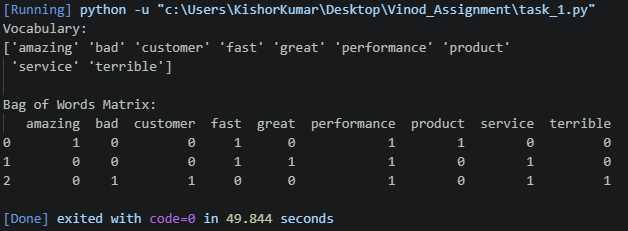
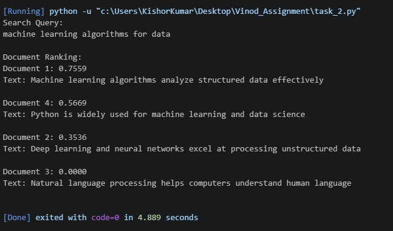

# LAB EXERCISE 04: Vector Space Modeling — Bag of Words (BoW) & Cosine Similarity

**Course:** Natural Language Processing (CS-602/DS-604)
**Student Name:** Vinod Kumar
**Roll No:** 2K24/AI/94
**Program:** BS Artificial Intelligence
**University:** University of Sindh, Jamshoro

## Objective

Implementation of **Bag of Words (BoW)** and **Cosine Similarity** to represent textual data as numerical vectors and compute pairwise document similarity using Python's `scikit-learn` library.

---

## Task 1: Bag of Words Matrix Construction

*Constructing a vocabulary and generating a term-frequency matrix using `CountVectorizer` with English stop words removed.*

### Input Corpus

```python
corpus = [
    "The product performance is amazing and fast",
    "The service was fast and performance was great",
    "Terrible customer service and bad performance"
]
```

### Output Screenshot:

<!-- Replace the image path with your actual screenshot -->



---

## Task 2: Document Search Engine & Relevance Ranking

*A mini search engine that accepts a search query and ranks documents based on cosine similarity scores.*

### Input Documents

```python
documents = [
    "Machine learning algorithms analyze structured data effectively",
    "Deep learning and neural networks excel at processing unstructured data",
    "Natural language processing helps computers understand human language",
    "Python is widely used for machine learning and data science"
]

query = ["machine learning algorithms for data"]
```

### Output Screenshot:

<!-- Replace the image path with your actual screenshot -->



---

## Section 5: Lab Viva & Reflection Answers

### 1. Word Order Invariance

The **Bag of Words (BoW)** model counts word occurrences but ignores grammar and word order. As a result, **"Dog bites man"** and **"Man bites dog"** produce the same Bag of Words representation.

This can negatively affect sentiment analysis and other NLP tasks because word order can carry important meaning. For example, a basic BoW representation may have difficulty understanding the difference between **"good"** and **"not good"**, because it does not capture the relationship and order between words.

### 2. Sparsity Issue

When a corpus contains **100,000 unique vocabulary words**, every document is represented as a vector with **100,000 dimensions**.

Most documents will contain only a small portion of these words, so most values in the BoW matrix will be **zero**. This produces a highly **sparse matrix**.

A large vocabulary therefore increases the memory requirements and computational cost of storing and processing the matrix. Sparse matrix representations can be used to store such data more efficiently.

### 3. Zero Similarity

Document 3 is:

```text
Natural language processing helps computers understand human language
```

The query is:

```text
machine learning algorithms for data
```

After applying the same vocabulary and preprocessing, Document 3 has no overlapping terms with the query. Therefore, the dot product between their vectors is **zero**.

According to the cosine similarity formula:

```text
Cosine Similarity = (A · B) / (||A|| ||B||)
```

Since:

```text
A · B = 0
```

the cosine similarity is:

```text
0.0000
```

## This means the two document/query vectors are orthogonal and have no term-based similarity.

---

## Technologies Used

* Python 3.8+
* NumPy
* Pandas
* Scikit-learn
* Jupyter Notebook / VS Code

### Required Libraries

```python
import pandas as pd
import numpy as np
from sklearn.feature_extraction.text import CountVectorizer
from sklearn.metrics.pairwise import cosine_similarity
```

### Installation

```bash
pip install numpy pandas scikit-learn
```

---

## Repository Structure

```text
nlp-lab-04-bow-cosine/
│
├── solution.py
├── task-1.png
├── task-2.png
└── README.md
```

---

## Conclusion

This laboratory exercise demonstrated how textual data can be converted into numerical representations using the **Bag of Words** model. `CountVectorizer` was used to extract vocabulary and generate term-frequency vectors.

Cosine Similarity was then used to measure the similarity between a search query and multiple documents, allowing the documents to be ranked according to their relevance.

The exercise provides a basic foundation for understanding **Vector Space Modeling** and its application in simple information retrieval systems.
